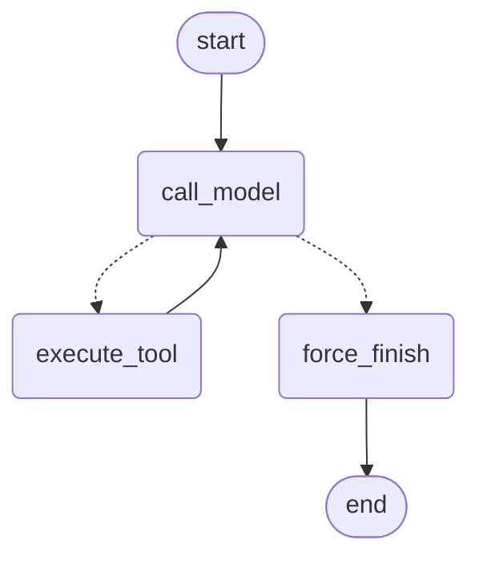

# LangGraph: custom vs prebuilt vs ReAct 6.2 (ДЗ 6.3)

Дата прогона: 31 августа 2026, ~09:22–09:26 МСК.  
Модель — Polza `openai/gpt-4o-mini`, `temperature=0` у графов. ReAct 6.2 — тот же Polza, без temperature (дефолт провайдера).  
Коллекция RAG: `rag_eval_1024`. `send_telegram_message` — `print`.  
Пакеты: langgraph 1.2.11, langchain 1.3.18, langchain-openai 1.6.0.  
Сырые числа: `docs/agent-graph-bench.json` (5 задач × 3 реализации × 3 повтора).

## 1. Конфигурация

| Параметр | Значение |
|----------|----------|
| Модель | `openai/gpt-4o-mini` через Polza (`ChatOpenAI` + `base_url`) |
| Температура (графы) | 0 |
| `MAX_ITERATIONS` custom | 6 (после 6-го `call_model` → `force_finish`) |
| ReAct 6.2 | `max_iterations=10`, critic max 2 |
| Tools | `search_knowledge_base`, `get_current_time`, `send_telegram_message` (`@tool`, те же функции, что в 6.1/6.2) |
| Системный промпт | тот же ReAct-текст, что в `agent_react.py` |

CLI: `python -m app.services.agent_graph "…"`, `--prebuilt` для create_agent.  
Схемы: `python scripts/visualize_graph.py` → `docs/agent-graph-custom.mmd`, `docs/agent-graph-prebuilt.mmd` (PNG тоже сохранился).

## 2. State contract

`AgentState` — только сериализуемые данные, без SDK-клиентов и ключей.

| Поле | Reducer | Зачем |
|------|---------|--------|
| `messages` | `add_messages` | история Human / AI / Tool; без reducer каждое обновление затирало бы чат |
| `iteration_count` | replace (нет Annotated) | счётчик вызовов модели, стоп-кран |
| `tool_results` | `operator.add` | журнал вызовов для отчёта; список накапливается, не перезаписывается |

На `ainvoke` кастомного графа передаём `iteration_count=0` и `tool_results=[]`. В `config` — `thread_id=f"bench-{task_id}"`: без checkpointer это no-op, к 6.4 интерфейс уже совместим.

## 3. Router и stop conditions

`route_after_model(state) -> Literal["execute_tool", "force_finish"]` — чистая функция, state не пишет, в сеть не ходит.

1. `iteration_count >= 6` → `force_finish` (даже если у последнего AI есть `tool_calls`).
2. Иначе если есть `tool_calls` → `execute_tool`.
3. Иначе → `force_finish`.

Рёбра: `START → call_model`; с `call_model` условно на tool или finish; `execute_tool → call_model`; `force_finish → END`.

Стоп проверен тестом: tool `broken_search` всегда возвращает «пусто», фейк-модель бесконечно его вызывает — граф останавливается на 6-й итерации с текстом «Превышен лимит итераций». Неизвестный tool даёт `ToolMessage` с ошибкой, граф не падает.

## 4. Mermaid кастомного графа

Файл: `docs/agent-graph-custom.mmd`. Prebuilt (`docs/agent-graph-prebuilt.mmd`) — узлы `model` / `tools`, без явного `force_finish`.

## 5. Бенчмарк (среднее по 3 прогонам)

Те же 5 задач, что в 6.2. Реализации: **react** = цикл из `agent_react.py`; **custom** = StateGraph; **prebuilt** = `langchain.agents.create_agent`.

| Задача | Реализация | latency_ms | prompt_tokens | completion_tokens | total_steps |
|--------|------------|------------|---------------|-------------------|-------------|
| 1. Телефон визит-центра | react | 8092.7 | 1761.0 | 54.3 | 2.0 |
| 1. Телефон визит-центра | custom | 3097.0 | 1371.0 | 53.0 | 2.0 |
| 1. Телефон визит-центра | prebuilt | 3375.0 | 1371.0 | 53.0 | 2.0 |
| 2. Время Europe/Moscow | react | 5412.1 | 977.0 | 43.0 | 2.0 |
| 2. Время Europe/Moscow | custom | 2741.6 | 891.0 | 38.3 | 2.0 |
| 2. Время Europe/Moscow | prebuilt | 2757.1 | 891.0 | 38.3 | 2.0 |
| 3. Правила с собакой → чат 12345 | react | 18015.4 | 7056.7 | 447.0 | 5.0 |
| 3. Правила с собакой → чат 12345 | custom | 5086.5 | 2611.0 | 165.0 | 3.0 |
| 3. Правила с собакой → чат 12345 | prebuilt | 4666.2 | 2611.0 | 165.0 | 3.0 |
| 4. Телефон экскурсий → чат 55501 | react | 14706.1 | 3849.3 | 295.7 | 4.3 |
| 4. Телефон экскурсий → чат 55501 | custom | 4884.2 | 1917.0 | 100.7 | 3.0 |
| 4. Телефон экскурсий → чат 55501 | prebuilt | 4566.9 | 1917.0 | 95.7 | 3.0 |
| 5. Стих, без tools | react | 2730.5 | 424.0 | 56.0 | 1.0 |
| 5. Стих, без tools | custom | 1661.6 | 432.0 | 36.0 | 1.0 |
| 5. Стих, без tools | prebuilt | 1671.2 | 432.0 | 36.0 | 1.0 |

На задачах 1–4 custom и prebuilt отвечают так же по смыслу, что react, но быстрее и дешевле: нет critic. На composability react из‑за ложных `REVISE` делает лишние `send` (3–5 шагов против стабильных 3 у графов).

Задача 5: **ни один не вызвал tool** (критерий провокации выполнен). React написал четверостишие. Custom и prebuilt при `temperature=0` и фразе «не выдумывать данные» отказались писать стих — корректно по tools, хуже по тексту ответа.

## 6. Custom vs prebuilt

Что писали руками в custom: `AgentState` и reducers, три узла, router, `MAX_ITERATIONS`, журнал `tool_results`, подмешивание system-сообщения на каждом `call_model`.

Что prebuilt сделал сам: цикл model ↔ tools, системный промпт аргументом `create_agent`, свой граф из двух узлов. Нет `iteration_count`, нет `force_finish`, нет нашего `tool_results`.

Числа custom и prebuilt почти совпали (одни tools, одна модель, один промпт). Разница latency в пределах шума сети.

Для диплома дальше берём **custom**: в 6.4 нужны interrupt, checkpointer и явный стоп — это поля state и узел, которых у prebuilt нет. Prebuilt удобен как эталон «LangChain из коробки» и как subgraph, если позже понадобится supervisor.

## 7. Баг при отладке

Сначала `call_model` на каждом шаге вызывал `chat.bind_tools(tools)`. Юнит-тест стоп-крана на `FakeMessagesListChatModel` падал с `NotImplementedError`: у фейка нет `bind_tools`. Перенесли bind на сборку графа и ловим `NotImplementedError` — для ChatOpenAI bind один раз, тесты с фейком идут без сети.

Второй сюрприз (уже на бенче, не в тесте): тот же SYSTEM, что у react, на графах с `temperature=0` запретил стих на задаче 5. React без нулевой температуры стих написал. Tools не вызывались в обоих случаях.

## 8. Что блокирует персистентность / чекпойнтинг

`thread_id` в `config` уже передаём. Без checkpointer LangGraph его игнорирует: повторный вызов с тем же id не восстанавливает `messages`. Для 6.4 нужно:

- `compile(checkpointer=…)` — AsyncSqliteSaver / Postgres, не Memory на проде;
- один `thread_id` на диалог, не новый uuid на каждый HTTP-запрос;
- не класть в state httpx/OpenAI-клиенты (сейчас не кладём);
- `interrupt` перед `send_telegram_message` — узел есть, паузы ещё нет.

`python scripts/verify_eval.py` после фиксации пакетов: ragas 0.4.3 импортируется.
