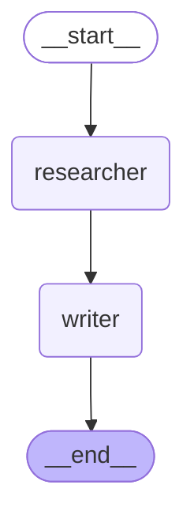

# Мультиагент researcher → writer (ДЗ 6.5)

Сначала пробовали `langgraph_supervisor.create_supervisor`: на Polza handoff-tools дают 502 «некорректный вызов инструмента». Рабочий вариант — ручной граф `Command(goto=...)`: START → researcher → writer → END. InMemorySaver, thread_id префикс `exp-langgraph`.

