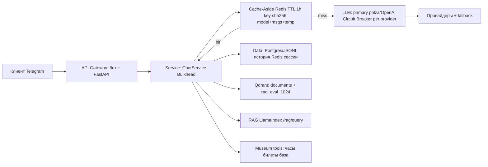

# Архитектурный паспорт: ИИ-консультант музеев Казанского Кремля

## Схема слоёв

Точки отказоустойчивости: Circuit Breaker на каждом LLM-провайдере. Fallback chain: primary (polza.ai / OpenAI-совместимый) → второй облачный ключ → шаблонный ответ из `data/museum_kb.json`. Cache-Aside стоит перед LLM: ключ `sha256(model + messages + temperature)`, TTL 1 час.

## ADR-001: Паттерн взаимодействия

**Status:** Accepted (2026-08-21)

**Context.** Проект — консультант музея в Telegram. Нагрузка на защите и в пике небольшая: порядка 30–100 сообщений в час, средний ответ 150–400 токенов, бюджет единицы–десятки долларов в месяц. Важен живой UX, а не пакетная обработка.

**Decision.** Основной паттерн — **Streaming через SSE** между backend и ботом. Бот показывает черновик (`sendMessageDraft`) или редактирует сообщение.

**Consequences.** Плюс: посетитель сразу видит, что бот «печатает». Минус: нужно держать HTTP-соединение несколько секунд; nginx не должен буферизовать SSE.

**Alternatives.** Request-Response отвергнут из-за паузы 5–10 секунд. Queue-based избыточен для интерактивного чата.

## ADR-002: Fault tolerance

**Decision.** Primary — OpenAI-совместимый API (polza.ai, gpt-4o-mini). Fallback — второй совместимый endpoint. Tertiary — готовые тексты кнопок (часы, билеты, афиша) без LLM. Circuit breaker логически «по провайдеру»: ошибка auth/5xx не валит весь сервис, бот отвечает понятной фразой.

**Consequences.** Кнопки меню работают даже при падении LLM. Свободный текст деградирует до «сервис недоступен, попробуйте позже».

## Потенциальные точки отказа

| Слой | Что будет при выпадении | Смягчение |
|------|-------------------------|-----------|
| Gateway / бот | Нет входа из Telegram | Polling + /notify на том же процессе; рестарт compose |
| Service FastAPI | Нет LLM и истории | Health/ready; бот показывает «сервис недоступен» |
| LLM | Нет свободных ответов | Кнопки меню + fallback-провайдер + шаблоны |
| Data Redis | Нет кеша | Запросы идут в LLM, /ready=503, /health=200 |
| Data Postgres/JSON | Нет истории | JSON-режим как запасной `CHAT_REPOSITORY=json` |

## Нагрузка (оценка)

- RPM: до 30 в пике на защите, до 100 при публикации бота
- TPM: ~15–40k
- Средний ответ: 200–400 токенов
- Бюджет: до $5–15 / месяц на gpt-4o-mini
- Целевой cache hit rate: 10–20% на повторяющихся FAQ

## LiteLLM

Готовый `docs/litellm/config.yaml`: primary + fallback. Для учебного проекта **свой FastAPI-gateway уже закрывает ДЗ 3.4** (DI, кеш, SSE, ошибки). LiteLLM имеет смысл как внешний proxy, если появятся несколько ключей/моделей без правки кода. Решение: не тащим LiteLLM в runtime диплома, конфиг оставляем как запасной вариант `litellm --config docs/litellm/config.yaml`.
