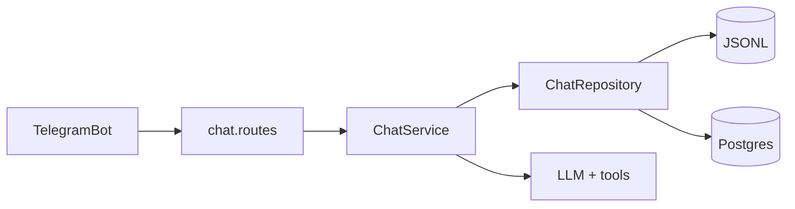

# Архитектура чата

## Схема


```mermaid
flowchart LR
  client[TelegramBot] --> routes[chat.routes]
  routes --> service[ChatService]
  service --> repo[ChatRepository]
  service --> llm[LLM + tools]
  repo --> json[(JSONL)]
  repo --> pg[(Postgres)]
```

## Стратегия контекста

Выбран **sliding window** (`CHAT_CONTEXT_WINDOW=10` по умолчанию). Диалоги музея короткие: часы, билеты, афиша, одно уточнение. Полный hybrid-summary избыточен и дороже. После окна применяется `fit_to_budget` (tiktoken `o200k_base`).

## Endpoints

Создать чат (идемпотентно по owner+interface):

```bash
curl -X POST http://localhost:8000/chats -H "Content-Type: application/json" \
  -d '{"owner_external_id":"user-123","interface":"cli"}'
```

Сообщение (multipart + SSE):

```bash
curl -N -X POST http://localhost:8000/chats/<chat_id>/messages \
  -F "content=До скольких открыты музеи?"
```

История / очистка / метаданные:

```bash
curl "http://localhost:8000/chats/<chat_id>/messages?limit=50"
curl -X DELETE http://localhost:8000/chats/<chat_id>/messages
curl http://localhost:8000/chats/<chat_id>
```

Системное уведомление в Telegram:

```bash
curl -X POST http://localhost:8000/chats/<chat_id>/system-message \
  -H "Content-Type: application/json" \
  -d '{"text":"Завтра музей закрыт","notify":true}'
```

## Хранилище

`CHAT_REPOSITORY=json` — файлы в `CHAT_STORAGE_DIR`.  
`CHAT_REPOSITORY=postgres` — после `alembic upgrade head`. Soft-delete: JSON-маркер `soft_delete`, в Postgres поле `deleted_at`.
