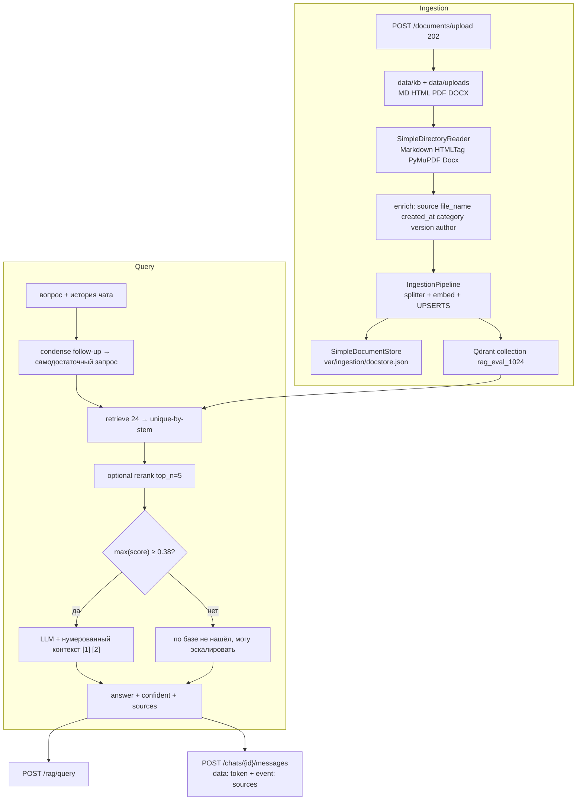

# RAG-ассистент музеев Казанского Кремля (ДЗ 5.5)

Корпоративный контур: **ingestion** (PDF/DOCX/HTML/MD → Qdrant) и **query** (retrieve → score-guard → цитаты `[1]`, `[2]`). Для меняющихся сведений — выставок, афиши, вопросов «сегодня», «сейчас», «в эти выходные» — перед RAG выполняется живое чтение только официального домена `kazan-kremlin.ru`. Для названного музея также читается его официальная страница. Если сайт недоступен, запрос автоматически возвращается к локальному RAG. Чат и Telegram используют этот единый маршрут через `POST /chats/{id}/messages`.

## Версии

Зафиксировано в `requirements.txt`:

| Пакет | Версия |
|--------|--------|
| llama-index | 0.14.24 |
| llama-index-readers-file | 0.6.0 |
| qdrant-client | ≥1.16 |
| pymupdf | ≥1.24 |
| pydantic | 2.11.7 |
| aiogram | 3.22.0 |

LLM и эмбеддинги — Polza: `OPENAI__DEFAULT_MODEL=openai/gpt-4o-mini`, `EMBEDDING_MODEL=openai/text-embedding-3-small`, dim **1536**, distance **COSINE**.

## Архитектура



## Параметры chunking (из ДЗ 5.4)

На golden-наборе 22 вопроса ДЗ 5.4 выиграла стратегия **fixed** (`TokenTextSplitter`): Hit@5 = 1.0, MRR@10 = 1.0. После оценки RAGAS (ДЗ 5.6) в проде размер чанка **1024**, не 512 — см. [rag_evaluation.md](rag_evaluation.md). Текущие дефолты:

| Параметр | Значение |
|----------|----------|
| `RAG_CHUNK_STRATEGY` | `fixed` |
| `RAG_CHUNK_SIZE` | 1024 (победитель ДЗ 5.6; 512 был эталоном 5.4) |
| `RAG_CHUNK_OVERLAP` | 64 |
| `RAG_RETRIEVE_K` | 24 |
| `RAG_SIMILARITY_TOP_K` | 5 (после retrieve, это же top_n re-ranker) |
| `RAG_RERANK_ENABLED` | `false` |
| Re-ranker | `BAAI/bge-reranker-v2-m3` (локальный CrossEncoder, выключен) |

Rerank на CPU ~13 с на запрос и на коротком корпусе не улучшал MRR, поэтому по умолчанию выключен. Включить: `RAG_RERANK_ENABLED=true`.

## Score-guard и отказ

Порог `RAG_SCORE_THRESHOLD=0.38` (cosine, `text-embedding-3-small`). На прогоне 5.3 вопрос вне базы («кто выиграл ЧМ-2018») дал top_score **0.081**, музейные факты **0.54–0.60**. 0.38 лежит между этими кластерами: LLM не вызывается, в логах `rag_score_guard`, ответ дословно `по базе не нашёл, могу эскалировать`. Второй слой — тот же текст в системном промпте цитирования.

Коллекция `documents` из 5.2 и `rag_block_03` из 5.3 **не переиспользуются**: у LlamaIndex другая схема payload (`_node_content`). Рабочая коллекция после ДЗ 5.6: **`rag_eval_1024`**. Коллекция `rag_assistant` — индекс 512 из ДЗ 5.5, оставлен для сравнения.

## Endpoints

| Метод | Путь | Назначение |
|-------|------|------------|
| POST | `/rag/query` | синхронный ответ: `answer`, `top_score`, `confident`, `sources[{id,file_name,page,score,snippet}]` |
| POST | `/chats/{id}/messages` | SSE: `data` с токенами, затем `event: sources` |
| POST | `/documents/upload` | 202, файл в `data/uploads/`, ingest в BackgroundTasks |
| POST | `/chats/{id}/messages/{mid}/feedback` | 👍/👎 |

Telegram: бот зовёт `/chats/{id}/messages`, `editMessageText` не чаще чем раз в **700 мс**.

## Запуск

```bash
python scripts/download_data.py
docker compose up -d qdrant
python scripts/ingest.py data/
python scripts/ingest.py data/
uvicorn app.main:app --host 127.0.0.1 --port 8000
curl -X POST http://127.0.0.1:8000/rag/query -H "Content-Type: application/json" -d "{\"question\": \"Какой телефон визит-центра Казанского Кремля?\"}"
```

Повторный ingest печатает `0 changed, N unchanged` (DocstoreStrategy.UPSERTS). Корпус и размеры: [data_inventory.md](data_inventory.md).

Полный стек: `docker compose up -d` (app + qdrant + redis + postgres + phoenix + bot). Бот поднимайте только когда он нужен.

## LlamaIndex vs bare-metal (ДЗ 5.3)

В дипломе оставляем **LlamaIndex**. Bare-metal (`rag_block_03_bare`) — учебный эталон.

| Критерий | LlamaIndex | Bare-metal |
|----------|------------|------------|
| Форматы | PDF/DOCX/HTML/MD из коробки | только md/txt |
| UPSERTS / batch | IngestionPipeline | руками |
| Цитаты и re-ranker | промпт + опциональный CrossEncoder | каждый кусок руками |

Прогон пяти вопросов 5.3 (коллекция `rag_block_03`, отказ тогда звучал «В материалах музея этого нет»):

| # | Вопрос | top-1 / score |
|---|--------|----------------|
| 1 | Телефон визит-центра | contacts.md / 0.596 |
| 2 | Билет в Эрмитаж-Казань | tickets.md / 0.593 |
| 3 | С собакой на территорию | rules.md / 0.540 |
| 4 | Пятница, Эрмитаж: часы и цена | tickets.md / 0.557 |
| 5 | ЧМ-2018 | events.md / 0.081 → отказ |
